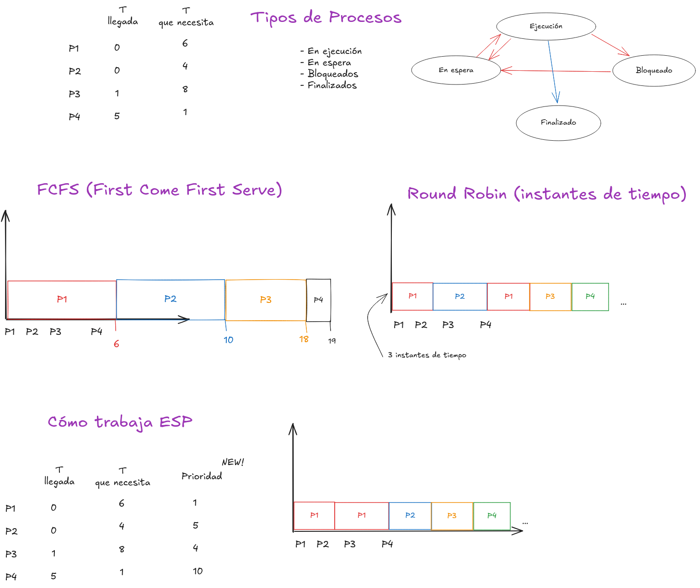

# Restricciones Temporales

- Restricciones de Tiempo: Cada proceso debe completarse durante el tiempo definido
- Respuesta Rápida: Latencias mínimas
- Compromiso de Rendimiento: Priorizar respuestas rápidas sobre el máximo rendimiento

# Sistemas de respuesta dura y blandas

## Dura:
El tiempo esperado de respuesta es crucial, ya que si no se cumple pueden haber consecuencias graves, hasta la destrucción del propio sistema.

## Blanda:
Si no se cumple el tiempo esperado de respuesta, es menos riesgoso a accidente.

# OS:

## Gestión de Recursos de sistema:

- Procesador: Coordina la asignación de tiempo de CPU a las diversas tareas y procesos de ejecución.
- Memoria: Administrar memoria del sistema, liberar espacio, asignar espacio.

## Gestión de Procesos:

- Planificación y Despacho: gestiona cambio de contexto (guardar el estado de una tarea en ejecución para permitir que otra se ejecute)
- Creación y Terminación de PRocesos: Permite a los programas crear y finalizar procesos (instancia de un programa en ejecución)

## Planificación de Procesos:

# Núcleos:

Consiste de CU y ALU (unidad de control y unidad aritmética lógica)

- CU: Controla las tareas que hace el ALU
- ALU: Hace las operaciones lógicas

## Hilos:
Permite tener procesos virtuales al tiempo, funcionan en paralelo durante un mismo proceso, haciendo diferentes operaciones(sub-procesos) . 

# FreeRTOS:
- Sistema operativo en tiempo real gratuito
- Diseñado para sistemas embebidos
- Necesita más memoria

## Conceptos:

- Tareas: Unidades individuales de ejecución (prender led, leer temperatura, leer humedad, recibirUART), darles prioridad.
- Sincronización: Manejo de periféricos necesitados por tareas
- Comunicación entre tareas: Transferencia de datos entre tareas, eventos
- Interrupciones: callbacks a partir de eventos en el hardware

## Métodos de Comunicación:

- Colas: Array de un solo tipo de dato y una longitud (Ring buffers), varios procesos pueden manipular la cola, si la cola está llena, se bloquea el proceso que vaya a agregar datos al array.
- Sincronización por eventos: Tareas que esperen a que algo pase (interrupciones), minimiza la actividad de las tareas, flexibilidad, sincronización entre tareas.
- Semáforos: Prioriza la utilización de recursos(periféricos, pines, botones) o datos de una tarea, evita conflictos entre tareas, hacer control de los recursos del sistema. Mutex(semáforo binario).

# Tarea:
Investigar FreeRTOS(IDF) esp32, esquemáticos del esp

